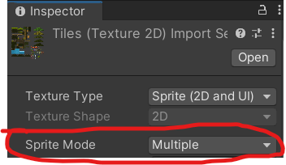
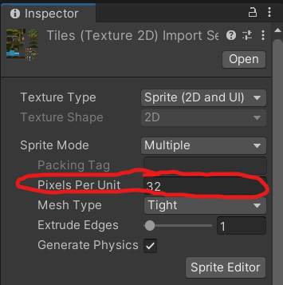
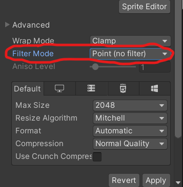
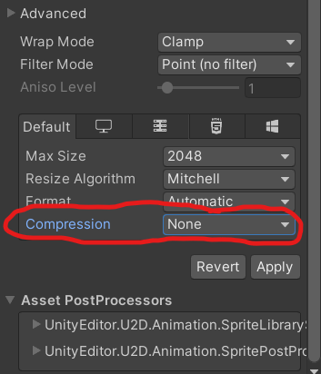

# How to get Unity Components from Game Scripts ? 
-   You can use the `GetComponent<Components's class>()` to get the Unity Components.
    ```
    using System.Collections;
    using System.Collections.Generic;
    using UnityEngine;

    public class GetComponent : MonoBehaviour
    {
        // Start is called before the first frame update

        private Rigidbody2D rbdy;
        private CapsuleCollider2D collider;
        private AudioSource speaker;
        private Animator anim;
        private Transform tf;

        void Start()
        {
            rbdy = GetComponent<Rigidbody2D>();
            collider = GetComponent<CapsuleCollider2D>();
            speaker = GetComponent<AudioSource>();
            anim = GetComponent<Animator>();

            speaker.Play();

            tf = transform; //You can get this because this script inherits from MonoBehaviour 
            //Transform tf2 = GetComponent<Transform>();    // You should use this whenever you ain't inheriting Monobehaviour. 

        }

        // Update is called once per frame
        void Update()
        {
            //rbdy.AddForce(new Vector2( 1f , 0f ));
            tf.position = new Vector3(tf.localPosition.x + 0.01f, tf.localPosition.y , tf.localPosition.z); 
    
        }
    }
    ```

# Introduction to TileMaps in Unity 

In order to create your own tilemaps  : 

1. Right click on the Hierarchy Tab -> 2D Objects -> TileMap 
    -   This will create a grid. In order to use tiles in unity we use the grid system. 

    -   This grid includes tilemap levels. In order to put a tile upon another properly , you need to create another tilemap object within that grid object. 

2. Upload your tileset.png to the Project tab. 
3. Click to the tileset.png from the project tab. This will open the inspector for that sprite object.
4. On the Inspector tab , follow this instructions : 
    1. Change the 'Sprite Mode' tab from Single to Multiple.
    

    2. Change the 'Pixel Per Unit' tab from 100 to 32 or 64 (depends on the tilemap)
    

    3. Change the Filter mode tab from 'Bilinear' to 'Point(no filter)'
    

    4. Change the 'Compression' tab from 'Normal Quality' to 'None'
    

5. Slice the Sprite by size from the Sprite Editor tab. 
6. From 'window' in the selection bar click to the '2D -> Tile Pallete' option.
7. Create a new pallete . After that , drag your tileset object to the tile pallete tab.


## How to freeze rotation - position of some GameObject in Unity ? 
- You can do that by `Go to the Rigidbody Component -> Go to the Contrains -> Freeze Rotation Z`

