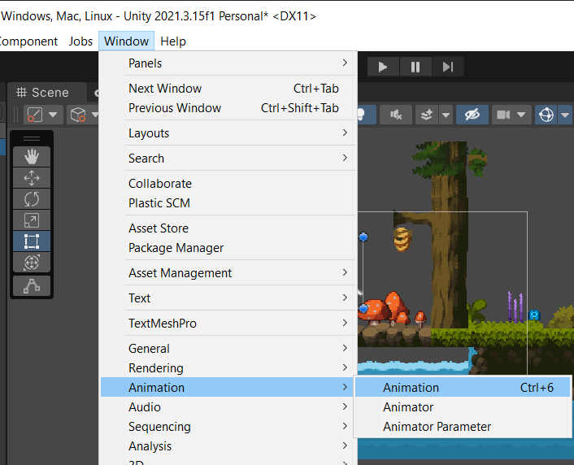
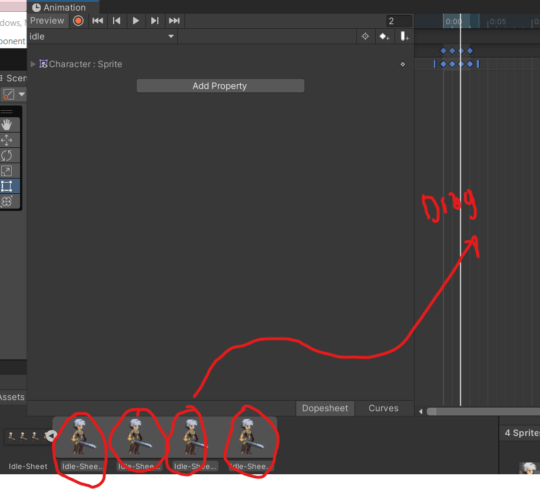
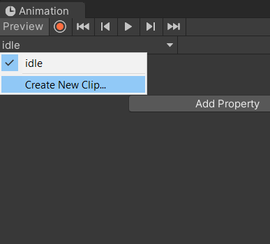
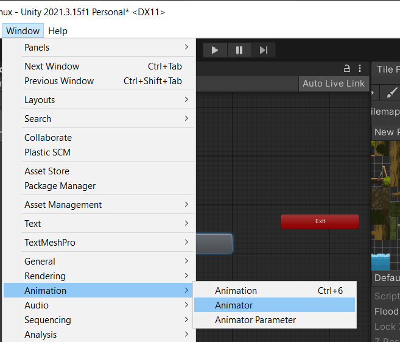
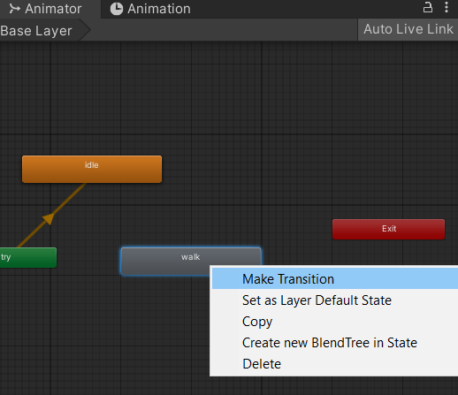
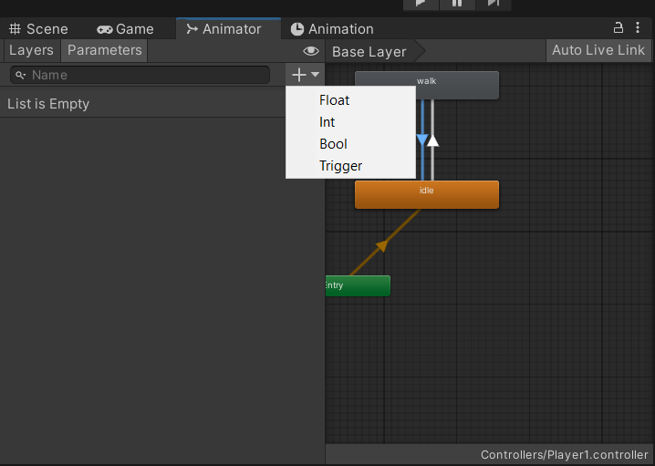
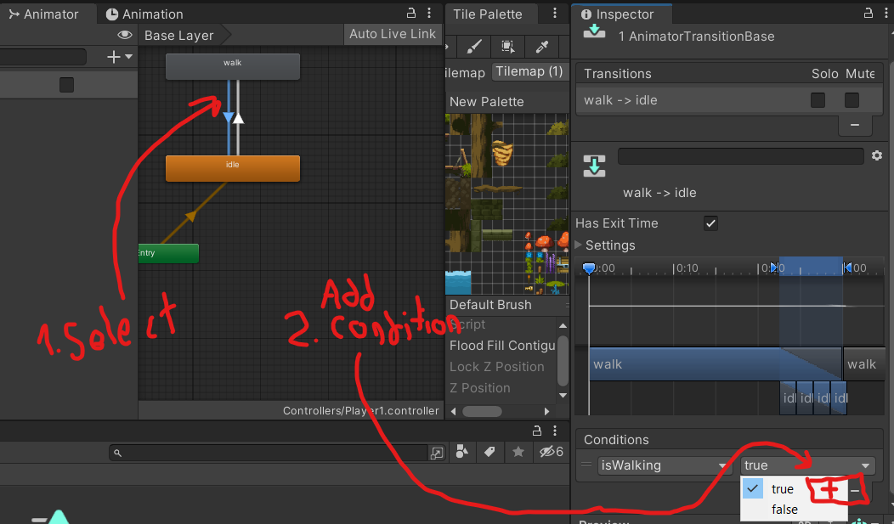

## Introduction to Animation Tab in Unity 
1.  Click to the GameObject and add the `Animation` Component from the `Inspector Tab` 
2.  Create another folder (to store other animator controllers) 
3.  Within that folder, `Right Click -> Create -> Animator Controller` . 
4.  Link that Animator Controller to the Animator Component of the GameObject by dragging upon.
5.  Open the `Animation Tab` from `Click to the Window from selection bar -> Animation -> Animation ` or press to `ctrl + 6` . 

6.  Click on the GameObject that you want to add animation. The `create` button from the animation tab is going to pop up. Click on it. Change the name to the name of the movement / animation e.g `idle` , `walk` , `attack` ... etc

7.  Select the sprites one by one and drag them into the animation tab.
 
  
8. You can add new animations from the `click to the selected animation name -> click to the 'Create New Clip' `
   

## How to control over animations ? How to manipulate the animation controller ? 
1. Select the gameobject that has an Animation Component which also has an animator controller.
2. Open the Animator Tab from the `SelectionBar -> Window -> Animation -> Animator`
    
3. You can link the animations by `Right Click on the animation -> Click to Make Transition ` and then drag the arrow upon the animation rectangle.
  
4. You should make conditions to make the transitions work properly. In order to do that create an Animation Parameter from the `Animator Tab -> (Layers) to (Parameters) -> Click on the Plus sign -> The data type that you would like to add`
  

5. Select the transition that want to add the condition. After that add a condition by pressing the plus button from the Inspector Tab.
   

## How to clone our character with the same components properly ? 

-   Without adding the components of the original character one by one , You can use `Prefabs` to clone your character. Just drag the GameObject from the Hierarchy tab into Project tab. By doing that , You will have a clone which has the copy of the same animations , rigidbodies , gamescripts ... etc.
  

