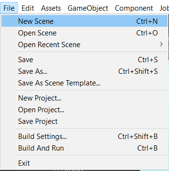
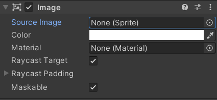

## How to sort sprites in Unity ? 
-   You can use the `Sort In Layer` and `Order In Layer` options to sort sprites within the Sprite Renderer Component. By saying 'sorting' what I mean is , which one of the sprites should be drawn first in order to create the depth of our 2D game. 
-   You can hold the V key while using the `move tool` to drag the object from it's corners in order to align it properly. 
     


## What does `FixedUpdate()` do ? How is it different than the normal `Update()` function ?
- Fixed update method applies after every fixed 'x' seconds. Most of the time it is used for physics calculations.

## How to make a Enemy Spawner (by using Co-routines) in unity ? 
-   Here is an example how can you make a spawner 

```
using System.Collections;
using System.Collections.Generic;
using UnityEngine;

public class Spawner : MonoBehaviour
{
    [SerializeField]
    public List<GameObject> EnemyList;

    [Header("Timing Options")]
    public float minimumWaitTime = 1f;
    public float maximumWaitTime = 10f;
    public bool IsSpawnerUsed = false;

    IEnumerator SpawnMonsters()
    {
        foreach(GameObject enemy in EnemyList)
        {

        if (minimumWaitTime < maximumWaitTime) yield return new WaitForSeconds(Random.Range(minimumWaitTime, maximumWaitTime));
        else yield return new WaitForSeconds(Random.Range(maximumWaitTime, minimumWaitTime));
        Instantiate<GameObject>(enemy , transform);
        }

        IsSpawnerUsed = true;
    }

    // Start is called before the first frame update
    void Awake(){StartCoroutine(SpawnMonsters());}

    // Update is called once per frame
    void Update(){if (IsSpawnerUsed) StopCoroutine(SpawnMonsters());}
}

```

- If a list of an object is created , by the help of the `[SerializeField]` you can create a list that is interactable with th unity's inspector like this :

    


## What is `Collusion Layers` in Unity? 
- Within the inspector tab , You can see `Layer->Default` on the top of the transform sub-section. These layers interacts and collides with each other. You can change which Layer will collide with which one from the `Edit -> Project Settings -> Physics2D or Physics -> 'Layer Collusion Matrix' sub-section`


  


## How can we make two colliders that are not trigger pass through each other? 
-   We can use Collusion Layers to make them pass through each other by disabling their their interaction with each other. 

- This could be useful feature when we are dealing with enemies. Enemies shouldn't be blocking each other. 


## How to make a basic Meele Attack System in Unity ? 
1.  First of all you need to set up your sprites for the attack animation.
2.  Make the attack animation by dragging the sprites upon to the Animation Tab. Make sure you unticked the `Loop Time` sub-section.
3.  On `Animator Tab` make transaction with the `Any State` 
4.  Make your transaction's `Has an exit time` to false and make `Transaction Duration` to 0 to make it instantly happen when you pressed the attack button. 
5.  Make a trigger from the `Animator Tab -> Parameters -> +v sign -> Trigger`
6.  Make another transaction from the Attack Animation to the Idle state. Make sure that your `Has an exit time` enabled and make your exit time to 1(in order your animation to go through all the animation frames). Make transaction duration equal to 0.
7.  In your controller script, in order to trigger the attack animation use the `animator.SetTrigger("ANIMATION_NAME")` method.
8.  In order to detect enemies that are affected by our attack , we have to determine an attack point by creating a child gameobject from the Player gameobject. 
9.  In your controller script declare this fields : 
    ```
        [SerializeField] private Transform attackPoint;
        [SerializeField] private float attackRange = 4f;

        private LayerMask enemyLayer;
    ```

10. In order to detect enemies from an area that centers on the attackPoint, use `Physics2D.OverlapCircleAll(Transform centerPoint , float radius , LayerMask filteredLayer)` or `Physics.OverlapSphereAll()`. This method stores all the colliders that are within the radius range from filtered Layer.
11. foreach through that colliders and call their "GetDamage" method.
    ```
        Collider2D[] detectedEnemies = Physics2D.OverlapCircleAll(attackPoint.position, attackRange, enemyLayer);
        foreach (Collider2D enemy in detectedEnemies) enemy.GetComponent<BombZombie>().GetHit();

    ```
12. In order to configure the attack range properly, you need to create `OnGizmosDraw()` method to demonstrate the attack range. 
13. In order to knock enemy back , you need to use this kind of logic : 
```
        Vector3 direction = (transform.position - player.position).normalized;
        this.GetComponent<Rigidbody2D>().AddForce(direction * knockbackforce);
```

## How to create a menu by using UnityUI Components step by step ? 



1. From window-bar select `File-> New Scene` 


2. Choose 2D-built-in scene and create it.


3. Click right click within Hierarchy Tab and select `UI -> Image`. As you can see after this proses , `Image` element is the child of the `Canvas` object because every UI element has to be the child of an Canvas object.Also after this proses , an `EventSystem` object created in order to detect the input from the UI elements.


4. Choose the renderer mode as  `ScreenSpace - Camera`

 

5. Drag the `Main Camera` into `Canvas->Render Camera` section. 


6. Choose the `Canvas Scaler Mode -> UI Scale Mode` as `Scale With Screen Size`


7.   Most of the games referance their game resolution from (1920x1080). And make sure the Screen Match Mode is `Match with Width or Height`.


8.   Choose your center point in order to make correct positioning in canvas. For an example , a health bar has to be near at the top left corner no matter what the resolution is. In order to do that you can position the health bar's center as top-left corner and then position it by depending on that corner.




9.   Drag a sprite to display the button into `Image -> Image Mode -> Source Image`


10.  You can stretch the Image element to make it fully fill the screen by the stretch option on bottom right of the `Anchor Presets`. 


11.   Make all attributes 0 in order to make it fully fill the screen .
  

## What are `Canvas Renderer Modes` and what they are used for ? 
1. In `ScreenSpace - Overlay` Mode , UI elements on the screen rendered on top of the scene , so that the Canvas will automatically change size to match the camera.
2. In `ScreenSpace - Camera` Mode , the Canvas is placed a given distance in front of a specified Camera and The UI elements are rendered by this camera, which means that the Camera settings affect the appearance of the UI.
3. In `WorldSpace` Mode ,the Canvas will behave as any other object in the scene so that the size of the Canvas can be set manually using its Rect Transform, and UI elements will render in front of or behind other objects in the scene based on 3D placement. So most of the time , it is used in 3D games to make **Diegetic UI** .

**Note** :Diegetic UI is UI made to look like it is entirely part of the game’s narrative. It is something that the character would interact with in their world. If it exists in the physical space of the video game, and is something the character could interact with, it is considered Diegetic UI. 

## What are `Canvas Scaler Modes` in Unity ? 

1. In `Constant Pixel Size` mode, positions and sizes of UI elements are specified in pixels on the screen. 
2. In `Scale with Screen Size` , positions and sizes can be specified according to the pixels of a specified reference resolution.
3. In `Constant Physical Size` mode, positions and sizes of UI elements are specified in physical units, such as millimeters, points, or picas.
