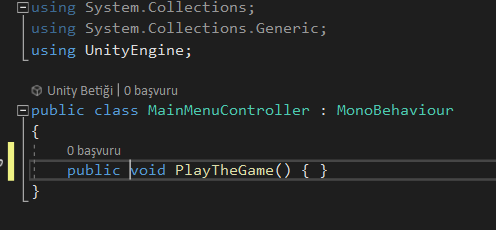
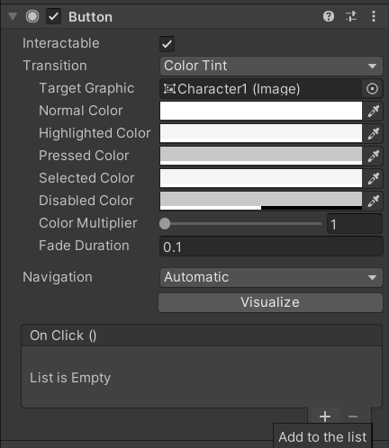
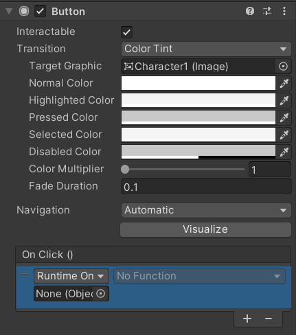
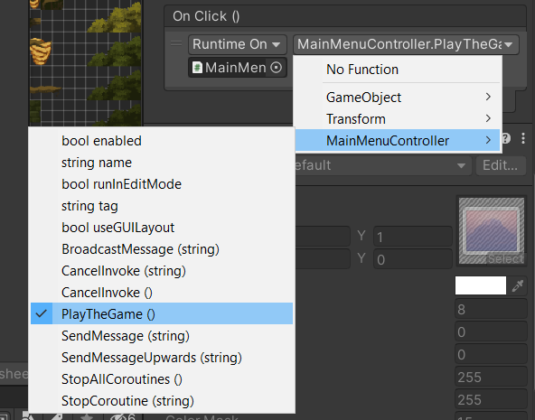
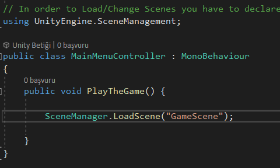
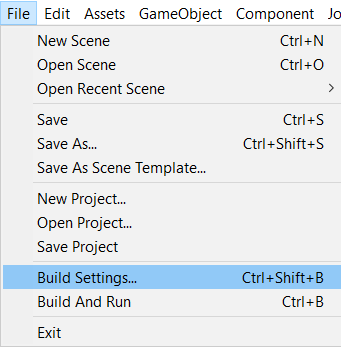
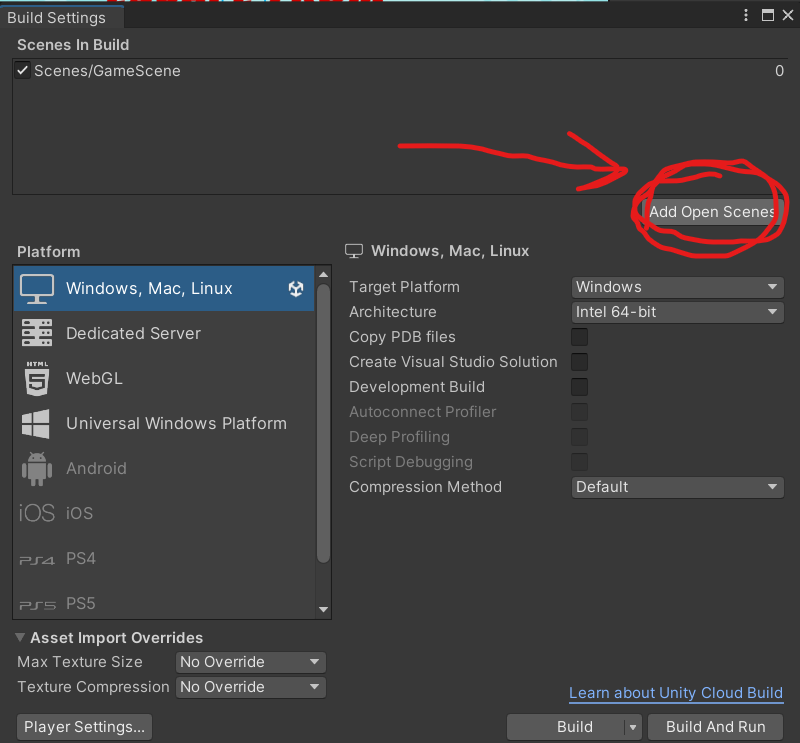

## How to navigate between different Scenes in unity ? 
1. Create an Empty GameObject called 'Main Menu Controller'

2. Create a C# Script called 'MainMenuController.cs'.Within that script create a blank method called `PlayTheGame()` . Make sure to make it `public` 

3. Click on the Button Object from the Hierarchy Tab. From Inspector tab, click on the `+` sign from the Button Mode. 

4. Drag the `MainMenuController` gameObject into the OnClick() section.

5. After dragging change `No Function` to `MainMenuController -> PlayTheGame()`.

    **Note:** If the `PlayTheGame()` method doesnt show up , make sure the method has `public` access.

6.  In order to make button change the Main Menu scene into GameScene , You have to use `ScreenManager.LoadScene()` method from the `UnityEngine.ScreenManagement` class. 

**Note:** If you encounter an error when loading the scene such as `Scene _SceneName_ couldn't be loaded because it has not been added to the build settings or the AssetBundle has not been loaded.` : 
1. Open/Double Click to the `_SceneName_` from `Project Tab -> Assets Folder`

2. From windowbar select `File -> Build Settings`

3. Click On the `Add Open Scenes` Button

## How to make GameManager That goes across multiple scenes by using Singleton Pattern in Unity ? 

-   When you load a new scene, the variables and gameObjects that are created by the past Unity Scene is destroyed. In order to make a gameObject that can't be destroyed on any other load , We have to use `DontDestroyOnLoad(gameObject)`.

-   the Singleton pattern is a design pattern that only permits single instance of a class .Singletons are useful when you want to have a central point of control and communication for a specific functionality, without having to create multiple objects or pass references around. For example, you might want to have a singleton class that handles the game settings, such as volume, difficulty, or language, and that can be accessed by any script that needs to read or modify them. Singletons can also help you avoid issues with duplicate or conflicting instances of the same class, which could cause bugs or performance problems.

    **Note:** Be aware to the fact that Singleton pattern mostly make stackoverflow developers sad because it is often overused as a global instance, why is that so bad? Because you hide the dependencies of your application in your code, instead of exposing them through the interfaces. Making something global to avoid passing it around is a code smell. 

    **Note:** Singleton is not a pattern to wrap globals. Singleton pattern should only be used to guarantee that one and only one instance of a given class exists during run time.People think Singleton is evil because they are using it for globals. It is because of this confusion that Singleton is looked down upon. Please, don't confuse Singletons and globals.

-  We only need one GameManager that is going to exist until the game is finished/closed. This means we only need one instance of the GameManager. Also creating two instance of the GameManager would be illogical to make. That is why we are using Singleton pattern to make a GameManager class.

