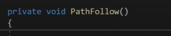

# How to use AStar Pathfinding project ?

1.  First of all, make sure that your ground has either TileMap Collider or Polygon2D collider just to make sure our ai works with good collusions. 
2.  Create a new Layer called "Ground" and set the TileMap Object's(which is the child of the Grid Object) Layer from 'Default' to 'Ground'. 
   

3.  Make sure that the Player character has a collider and a rigidbody

    
    


4. Create a gameObject for your enemy and attach these components : 

    

5. Create a gameObject in order to make A* project work properly. Then attach these components (Pathfinder comes automaticly with the "A* Project") : 
   

6. Make sure that the Position of the A* object is x=0 , y=0 , z=0 
7. Click on Graphs and  Add a new Graph as a Grid Graph. 
   
   

8. Click on the new Grid Graph to extend for more options.
   
   

9. Tick to 2D 
    
    


10. Tick the `Use 2D Physics` and change the collider type from `Circular` to `Point`.
   

11. Adjust the A* grid to make it cover the game scene.  (You can do this 1./ clicking to Scale from the unity tools 2./ choose the A* object)
Then press to Scan Button.
   

12. In order to make sensitive measurements, you need to lower the Node size and scale the A* grid again. 
13. In order to make A* project work correctly, you need to attach the `Seeker Script` to the Enemy Object.

   


## Writing the EnemyAI script


-  `pathUpdateSeconds` How often the ai is going to update the A* algorithm that we are using. 


-  `nextWayPointDistance` How enemy needs to be far away in order to start to move towards the Player 

- `jumpNodeHeightRequirement` How verticle the next node needs to be in order for character to actually jump.

- `jumpModifier` How high or high powerful the jump is for the Enemy. 
- `jumpCheckOffset` Collider parameter . Used to make sure colliders are fine. 


-  `followEnabled` if this parameter is false , then nothing in the script will work. 
-  `jumpEnabled` if the enemy can jump or not. 
-  `directionLookEnabled` if enemy will change directions or not. 


-  `path` comes from the Pathfinding Class in the A* Project. 
-  `seeker` is the script component that we attached to the enemy. 
-   `isGrounded` is for jump within the AI script. 
-   `currentWayPoint` ???


- `InvokeRepeating("UpdatePath",0f , pathUpdateSeconds)` This function will execute the Pathfinding script over and over again in order to move enemy properly. It work like a co-routine. Without this function the path will updated continously which is waste of memory.


-  In the `FixedUpdate()` there should be this calculations. We are going to make the method that are red-underlined later. 


-  If the target is within the distance and the seeker is Done calculation , we should start a new path continuously if we would like to Update our current path. 



-  `PathFollow()` method applies a long type of logic. So this method will be examined part by part. 


    

   1. If the path is null return nothing and if the wayPoint we are going to go is out of our scope of grid borders that comes from A* object , than return null. 


   

   2. See if something is colliding with the object by Raycasting. After that , calculate the direction. 
   
      **Note**: even the new version of isGrounded which they have used allows the enemy to fly if there is any type of background which uses a collider because the raycast is able to hit that background and thinks the enemy is grounded. Additionally, the enemy will be unable to jump if it is too close to an edge because the raycast goes down from the centre of the enemy (meaning if less the half of it is on land the raycast will not collide with the ground and you will not jump.)

   ```

      //Corrected line:
         RaycastHit2D isGrounded = Physics2D.BoxCast(
            col.bounds.center, 
            col.bounds.size, 
            0, 
            Vector2.down, 
            0.1f, 
            groundLayer
         );

   ```

      This creates a box to check weather you are grounded instead of a line, fixing the issue stopping it from jumping near edges and uses the LayerMask 'groundLayer' to make sure it only counts collisions with the ground and not any backgrounds (make sure to include all objects you want to be able to jump on in a layer include).


   
   3. Add Jump logic. 
   
   **Note**: In order to pretend jlittering in jumping apply this : 
   ```
        if (!isGrounded) force.y = 0;
        rb.AddForce(force);
   ```
   **Note**: In order to get more smooth moving you should apply `rb.velocity = Vector2.SmoothDamp(rb.velocity, force, ref currentVelocity, 0.5f);` instead of `rb.AddForce(force);`


   4. Apply movement logic by using the calculated force. Then calculate the distance to decide wheter should script follow the next waypoint by looking whose distance is smaller.
   

   
   5. Handle the Graphics for Direction. by that I mean the sprite of the character should be flipped if the velocity is positive (???). 


   6. `TargetInDistance()` function checks wheter the enemy is within the activeDistance range of the target.


   7. `OnPathComplete(Path p)` function is called when the path is completed. If there is an error,  the next path `p` will not be determined. 


   


